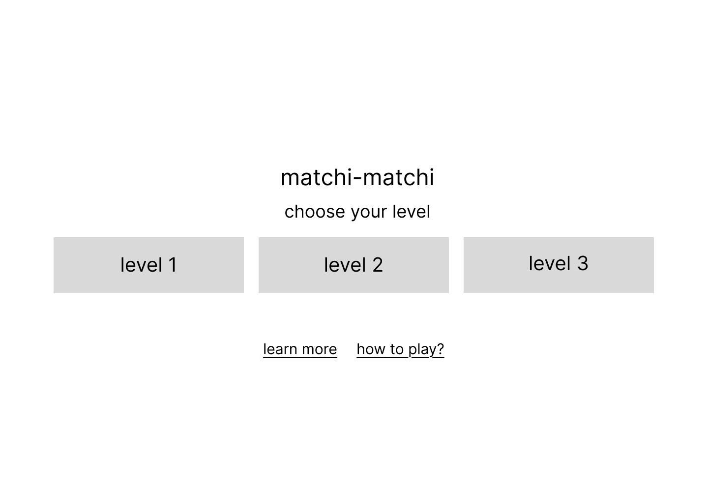
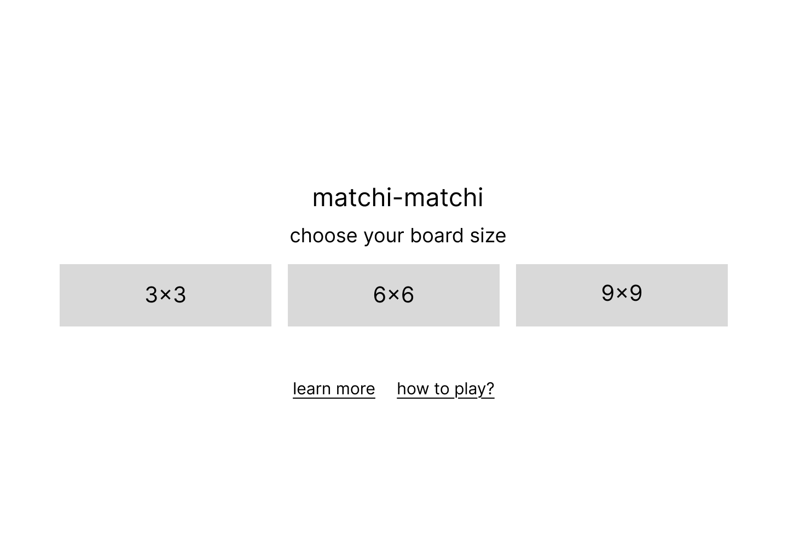
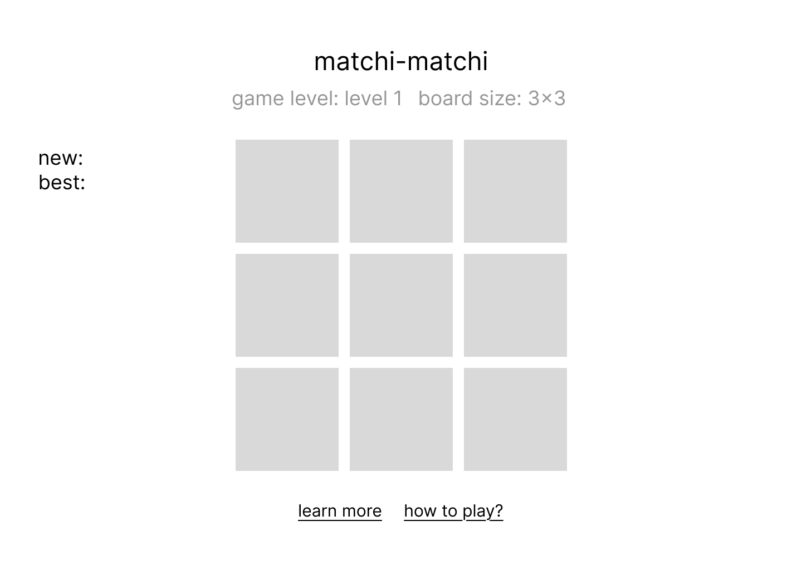

# matchi-matchi

(adorable) memory card game.

## Date: DD/MM/YYYY

### By: Maryam Ali Redha

#### [LinkedIn](https://www.linkedin.com/in/maryam-ali-hasan-98b9a3282/) | [GitHub](https://github.com/maryamalihasanebrahim) | [Email](http://www.gmail.com/)

---

### **_Description_**

#### this memory card game allows the user to choose the size of their board and randomizes the placement of the cards accordingly

---

### **_Technologies Used_**

#### i used figma to create wireframes to get my basic idea down and vs-code to program the entire thing

---

### **_Getting Started_**

---

### **_Screenshots_**

#### Landing Page

#### Landing Page 2

#### Game in Action

#### End of Game

---

### **_Pseudocode_**

Delared global variables like cards, pop-up messages, score display.  
For example:

- `let cards = document.querySelectorAll('.cards')`
- `let fruit = document.querySelectorAll('.fruit')`
- `let start = document.querySelector('.message')`

Then uncovered functions through diagrams drawn on paper.
For example:

- `updateScore = () => {currentScore++ scoreDisplay.innerText = 'new: ' + currentScore}`

Finally invoking those functions.

---

### **_Future Updates_**

---

### **_Credits_**

---
