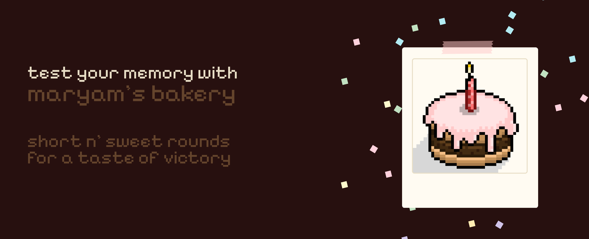
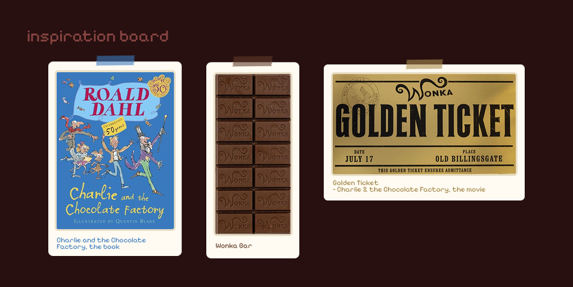
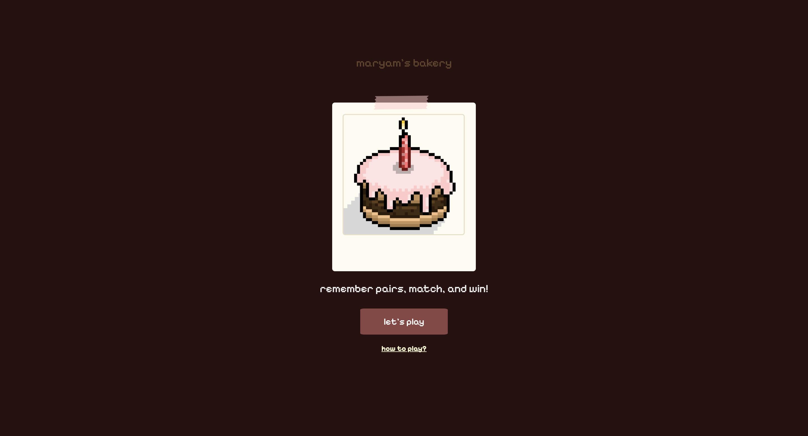
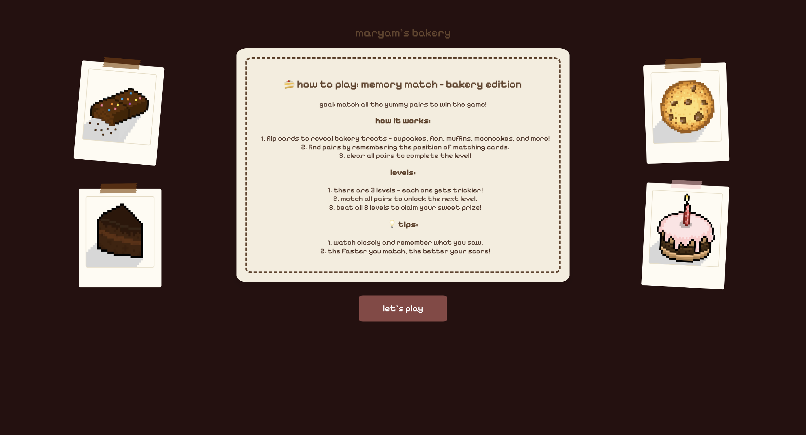
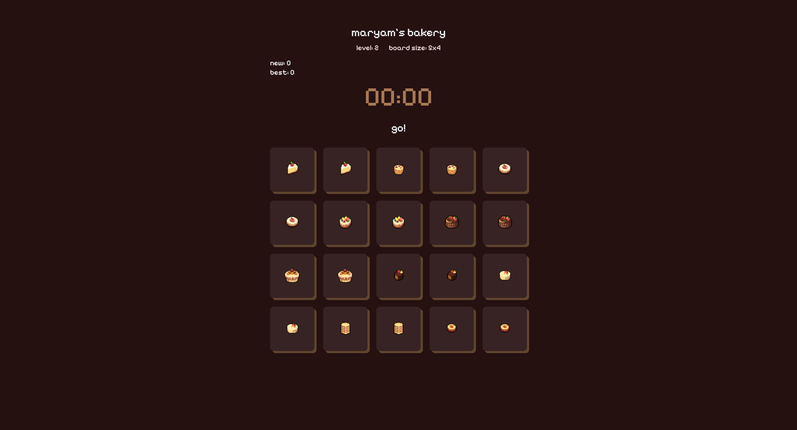
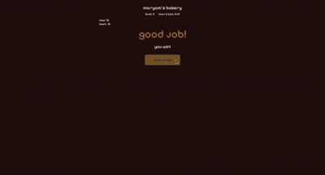

(https://apathetic-fight.surge.sh/)


# Maryam's Bakery

## Date: 08/07/2025

### By: Maryam Ali Redha

#### [LinkedIn](https://www.linkedin.com/in/maryam-ali-hasan-98b9a3282/) | [GitHub](https://github.com/maryamalihasanebrahim) | [Email](http://www.gmail.com/)

---

### **Description**

####

Maryam’s Bakery is a memory card game themed around classic baked treats. Match pairs across three levels, each increasing in difficulty.

Inspired by Charlie and the Chocolate Factory, the game’s design echoes the look of Wonka Bars, with a final Golden Ticket button that unlocks a selection of Maryam’s favorite chocolate dessert recipes — including brownies, cookies, and chocolate cake.

---

### **Inspiration & Theme**


---

The visual style and theme of Maryam's Bakery were heavily inspired by Charlie and the Chocolate Factory. The game draws from the whimsical, chocolate-filled world created by Roald Dahl, especially the iconic Wonka Bars and their coveted Golden Tickets.

In the movie, the Golden Ticket served as a magical entrance into Willy Wonka’s factory – a place where secret recipes, fantastical sweets, and imagination came to life.

In a similar spirit, completing all three levels of the game rewards players with a “Claim Prize” button – a nod to the Golden Ticket — which whisks them away to a secret recipe page.

There, instead of Everlasting Gobstoppers or Fizzy Lifting Drinks, players are treated to real favorite recipes:

Fudgy Brownies, Gooey Chocolate Chip Cookies, and Rich Chocolate Cake

Just like the movie, it’s a **sweet** reward for curiosity, perseverance, and a love of chocolate!

---

### **Technologies Used**

####

This project was:

Programmed using VS Code v1.101.2

- HTML, CSS, JavaScript

Designed using Figma v125.5.6

---

### **Screenshots**

#### Landing Page



#### How to Play?



#### Game in Action



#### Player Wins



---

### **Favorite Function**

The core of this game lies in the function below. Crafting it involved extensive logic planning and troubleshooting.
```
const heartOfTheGame = () => {
  if (timerOn) {
    shuffle()
    for (let i = 0; i < cards.length && heartBeat; i++) {
      cards[i].addEventListener('click', () => cardGame(i))
    }
  }

  const cardGame = (i) => {
    popup.innerText = ''
    // to prevent a card that has been clicked to be clicked again and provide the output of a pair
    if (cards[i] === firstCardElement) {
      return
    }

    if (!firstCard) {
      firstCard = cards[i].id
      firstCardElement = cards[i]
      fruit[i].style.opacity = '1'
      background[i].style.backgroundColor = 'white'
      firstIndex = i
      return
    }
    if (!secondCard) {
      secondCard = cards[i]
      fruit[i].style.opacity = '1'
      background[i].style.backgroundColor = 'white'
      secondIndex = i
      flippingAction(firstIndex, secondIndex)
      firstCard = ''
      secondCard = ''
      firstCardElement = ''
      return
    }
  }
}
```

---

### **Unsolved Problems**
#### 
Clicking the same pair of cards creates a loophole that allows players to bypass levels of the game. To address this, I suggest implementing an array of card objects, each with a boolean property indicating whether it has already been matched. This will prevent previously matched cards from being reused to skip rounds and increment the score.


---

### **Credits**

[Countdown Timer](https://docs.vultr.com/javascript/examples/create-countdown-timer)

[Shuffling Cards](https://marina-ferreira.github.io/tutorials/js/memory-game/)

---
